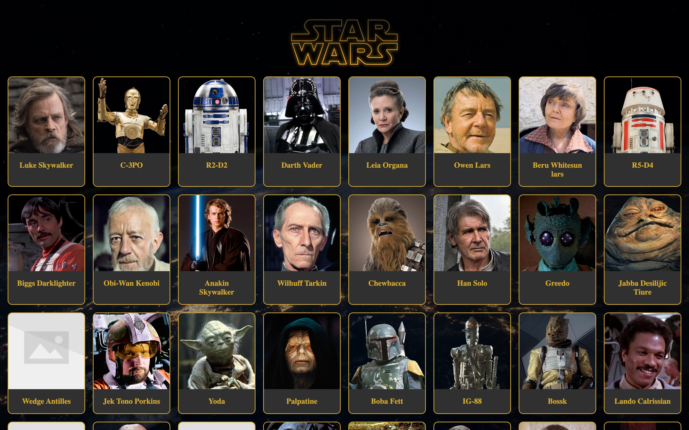
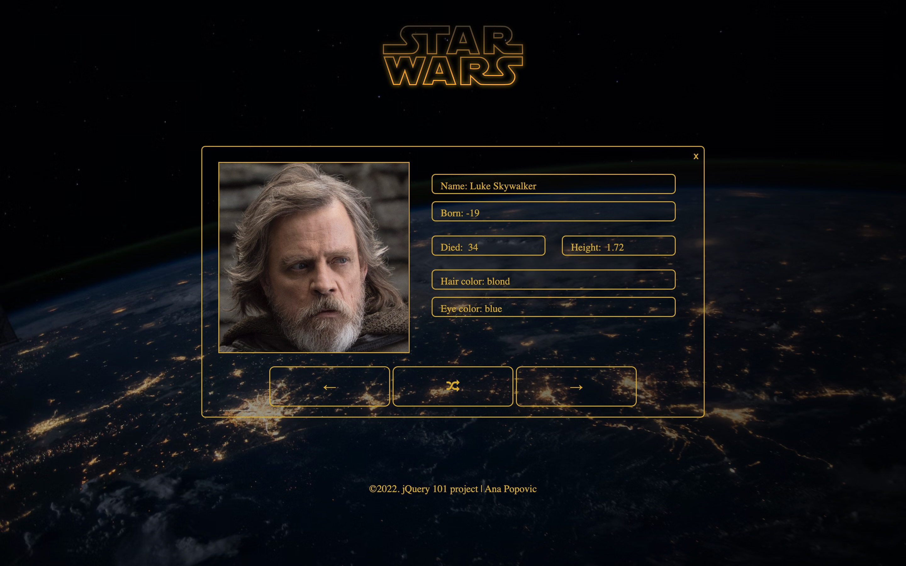

# Star Wars Character Generator
## About a project
My first jQuery project during my web development learning journey. 
Built with HTML, CSS, and jQuery which was used for communication with API, in order to show the advantage of using the library. The app selects characters and fetches their informations using https://akabab.github.io/starwars-api/api/all.json API.

## [Live Demo](https://rainbow-profiterole-bf35a3.netlify.app/)

